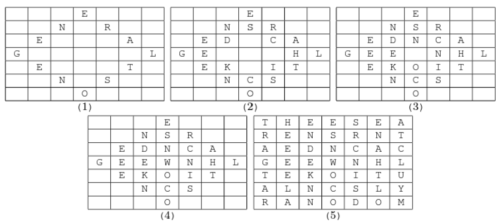

# Object Oriented Programming - Secret Message Encoder & Decoder

## Overview

This project is a C++ application designed to encode and decode secret messages using a unique square grid-based diamond pattern. The encoded message is a concatenated string formed by tracing diagonals within nested diamond shapes in the grid.

---

## Problem Description

Claude L. Evers, a top-secret agent, encodes messages using a diamond pattern in a square grid of letters. Messages are written from the middle left, moving diagonally up, right, down, and left, creating nested diamonds until all grid spaces are filled. Any leftover spaces are filled with random letters.

### Example:
Encoded message process for "GENERAL TSO NEEDS CHICKEN NOW":
1. First diamond filled.
2. Successively smaller diamonds filled.
3. Remaining spaces filled with random letters.

The final encoded string is sent as:  
`THEESEARENSRNTAEDNCACGEEWNHLTEKOITUALNCSLYRANODOM`

---

## Requirements

- **Object-Oriented Design**: Utilise classes and inheritance as appropriate.
- **Textual User Interface**:
  - Handle user input and errors gracefully.
  - Continue until the user chooses to quit.
- **File Handling**:
  - Options to use default or user-defined file names.
- **Grid Size Options**:
  - User-defined grid size.
  - Program-determined suitable grid size.
- **Encoding and Decoding**:
  - Accurately encode and decode provided sample messages.
- **Unified Modeling Language**
  - Produce an accurate and detailed UML for each class used in the program.

---

## Sample Messages

### Encoded and Decoded Examples
1. **Encoded**: `THEESEARENSRNTAEDNCACGEEWNHLTEKOITUALNCSLYRANODOM`  
   **Decoded**: `GENERALTSONEEDSCHICKENNOW`
2. **Encoded**: `WHAETHERENSRALLEENCAYGTELIHLKAKEITSARHCSEBIGMOACS`  
   **Decoded**: `GENERALTSOHATESCHICKENIEL`
3. **Encoded**: `JOMHNPARTAILUUHLASERINWGO`  
   **Decoded**: `IAMTHEWALRUSU`

---

## Program Features

### Menu Options
1. **Enter a Message**: Encode a new message.
2. **Load from File**: Encode a message from a file.
3. **Set Grid Size**:
  - User-defined or program-selected grid size.
4. **Decode Message**: Decode provided encoded messages.
5. **Save to File**: Save encoded/decoded messages.
6. **Exit**: Quit the program.

### Error Handling
- Robust handling for empty or incorrect inputs:
  - Empty messages
  - Non-numeric grid sizes
  - Invalid file names
  - Incorrect grid lengths

---

## UML Design

Each class includes:
- **Class Name**
- **Member Variables**: Names, types, and visibility.
- **Member Functions**: Names, return types, and parameters.